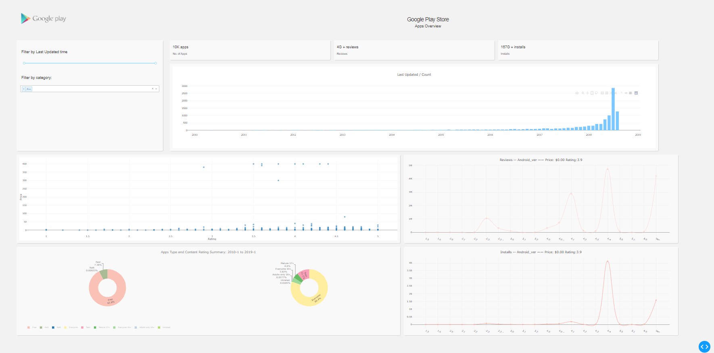
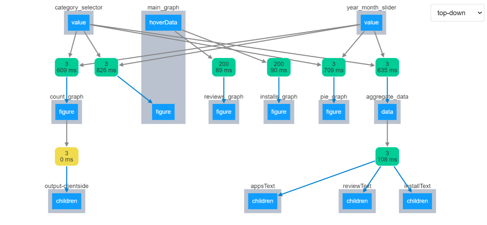
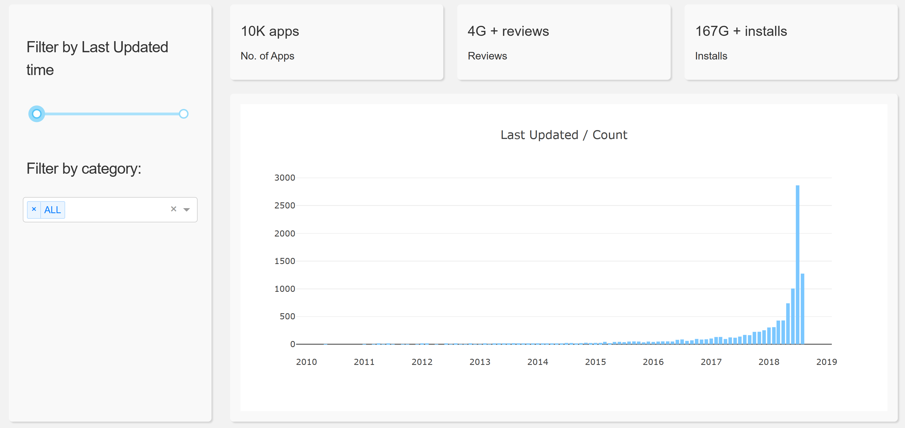
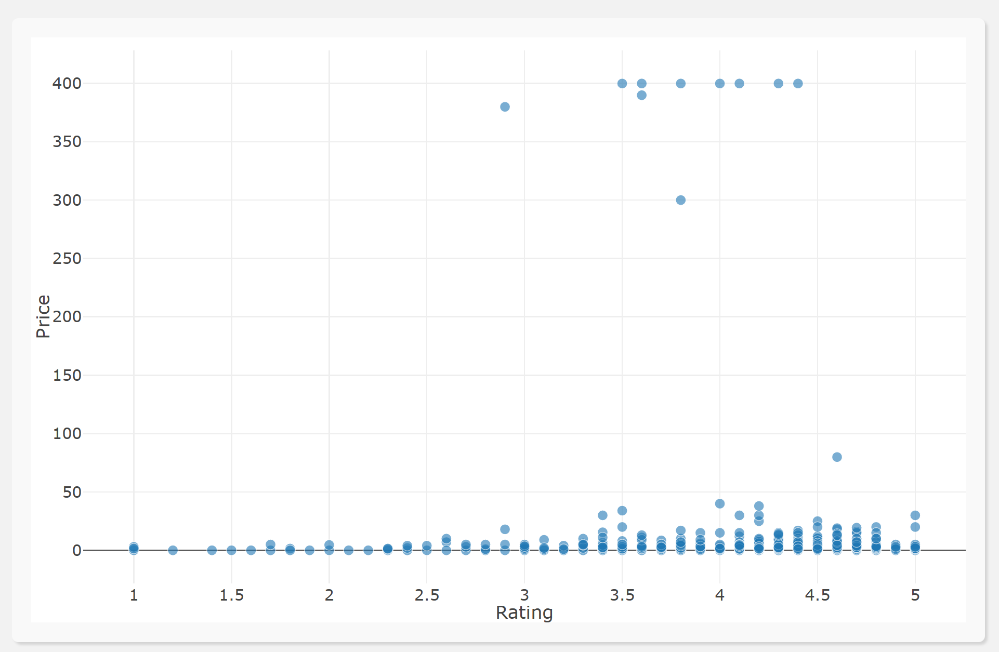
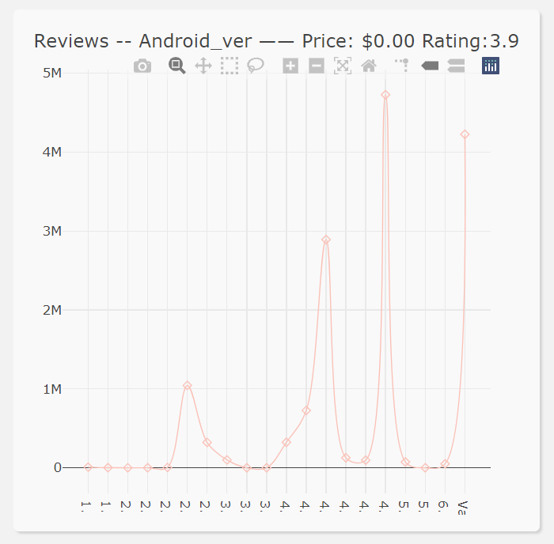
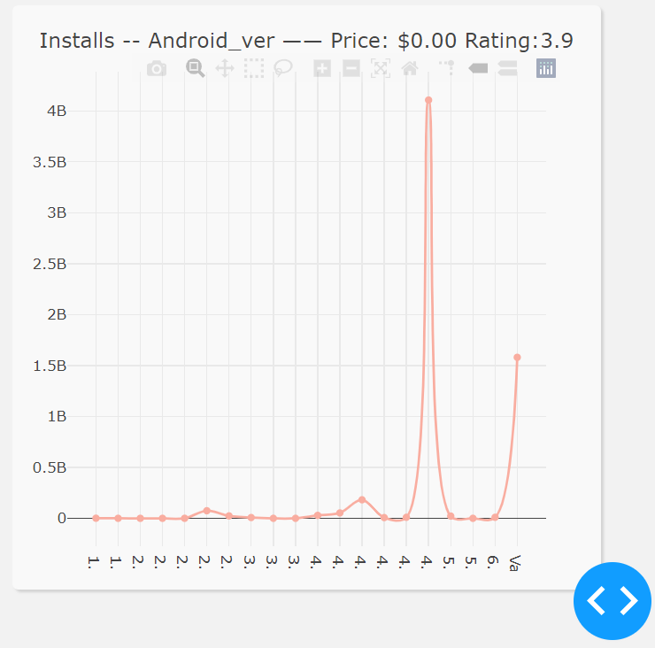
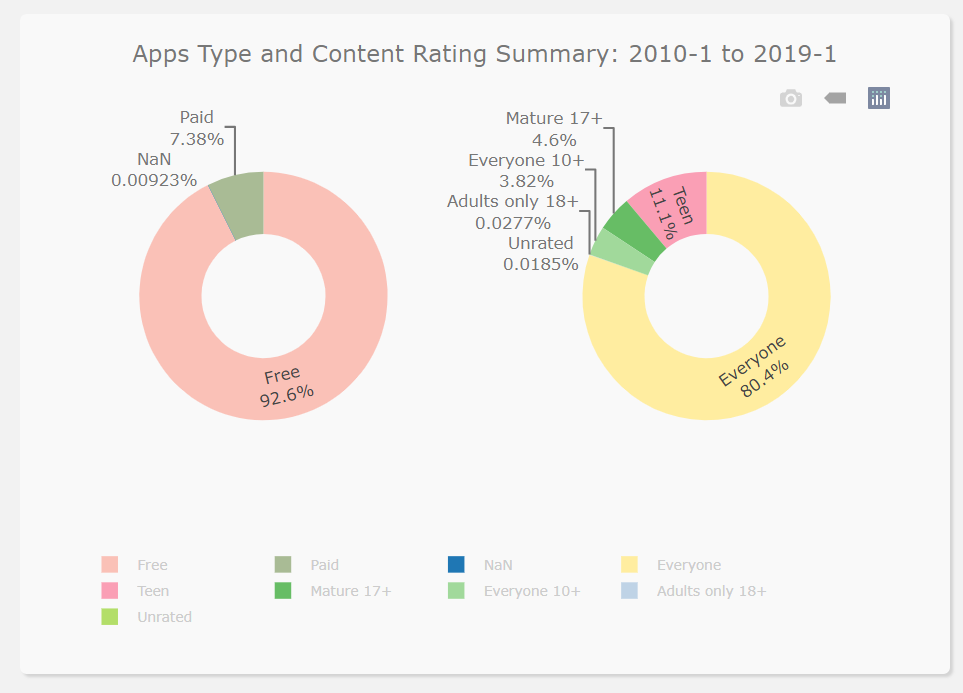

# Google Play Apps Data Visualization

### 1852345 MaoJingxin

---

## How to Run

#### Use Pycharm to open the `google_play` folder and run `my_app.py`

---

## Data preprocessing

- #### The original data file is `googleplaystore.csv`,because the format of some of the data columns does not meet the chart drawing requirements, data preprocessing is performed to generate a new data table `googleplaystore_new.csv`

### Related code —— `data_pre_treat.py`

- #### `pre_treat_ori_csv()`

  #### Perform data table preprocessing and generate a new data table, the main processing columns are:

  - `Last Updated` : standardize the irregular date format to `"%Y-%m-%d"`
  - `Android Ver` : replace `and up` to `+`
  - `Price` : remove `$`

- #### `get_data_by_categoryandlastupdated()` —— Obtain data according to Category and Last Updated, and mainly serve the following figure

  ####

- #### `get_data_by_priceandrating()` —— Get the rows through the corresponding `Price` and `Rating`,mainly serve the following figure

  ####

- #### `get_data_by_android_ver()` —— Get `reviews` and `installs` data through the corresponding `Android Ver`,mainly serving the following figure

- #### `human_format()` —— Large number unitization

- #### `cnt_aggregate()` —— Perform statistics on the number of `apps`, `reviews`, and `installs`, mainly serving the following figure

---

## Draw Figure

### Related code —— `my_app.py`

- #### `app.layout` —— General Layout
- #### `update_production_text()` —— Update the aggregate number of `apps`,`reviews` and `installs` according to `cnt_aggregate()`
- #### `make_count_figure()` —— Draw `Count Figure`
- #### `update_text()` —— Update the text of `apps`,`reviews`and `installs` according to `aggregate data`
- #### `update_main_figure()` —— Update `Main Figure` according to `category_selector` and `year_month_slider`
- #### `make_reviews_figure()` —— According to the scatter chart data of the hovering `Main Figure`, draw the `Reviews Figure`
- #### `make_installs_figure()` —— According to the scatter chart data of the hovering `Main Figure`, draw the `Installs Figure`
- #### `make_pie_figure()` —— Update `Pie Figure` according to `category_selector` and `year_month_slider`

## Layout View

## Figure Analyse

- ### RangeSlider —— `year_month_slider`
  ##### Pull the slider to update the `Last Updated` range of `Count Figure`
- ### Dropdown —— `category_selector`
  ##### Multi-choice column to select `Category` to sort and filter
- ### H6 —— `appsText`,`reviewText`,`installText`
  ##### Display statistical quantity (normalized by unit)
- ### Graph —— `count_graph`
  
  ##### The bar graph of Google Play Store Apps filtered by `Category` and `Last Updated`.
  ##### From the bar chart, we can see that the update speed of Google Play Store Apps was relatively average from 2010 to 2017, and the development was relatively slow.The update rate started to increase in 2018 and ushered in a blowout in July 2018.
  ##### And through random sampling statistics, it is found that all types of apps ushered in a rapid update wave in July 2018.
- ### Graph —— `main_graph`
  
  ##### It can be seen from the scatter diagram that the overall score of Google Play Store Apps is concentrated in the range of 3.5 to 4.7, and most applications are free.
  ##### Through observation, we can also know that as the price of an App increases, its score is generally closer to a higher score (basically higher than 3.5 points), indicating that users who are willing to buy an App can usually get quite satisfactory services from it.
- ### Graph —— `reviews_graph`
  
  ##### When the mouse hovers over each point of the `main_graph` scatter chart, a line graph of the total of `Reviews` in the order of `Android Ver` will be made according to the `Price` and `Rating` of the current hovering point
  ##### Although the number of graphs is large (each scatter of `main_graph` corresponds to a `reviews_graph`), from the results of random sampling, for apps with `Android Ver 4.4+`, users have rated the most. It can be estimated that most apps choose `Android Ver 4.4` is the R&D baseline
- ### Graph —— `installs_graph`

  

  ##### When the mouse hovers over each point of the `main_graph` scatter chart, a line chart of the total amount of `Installs` in the order of `Android Ver` will be made according to the `Price`and `Rating` of the current hovering point

  ##### Although there are a large number of graphs (each scatter of `main_graph` corresponds to an `installs_graph`), from the results of random sampling, for apps with `Android Ver 4.4+`, users download the most. It can be estimated that most apps choose `Android Ver 4.4` is the research and development baseline.

  #### The download curve is roughly similar to the comment curve, which also confirms the rationality of the data

- ### Graph —— `pie_graph`
  
  ##### The figure on the left shows the pie chart of `Type` filtered by `Category` and `Last Updated`.
  ##### As can be seen from the data in the figure, from 2010-1 to 2019-1, most of the apps in Google Play Store Apps (92%) are free, and only a small part (8%) adopt the paid method. Of course, the payment is here. It is different from whether there are actual costs in using an App. Most free apps do not mean that users will not invest money in them.
  ##### The figure on the right shows the pie chart of `Content Rating` filtered by `Category` and `Last Updated`.
  ##### As can be seen from the figure, from 2010-1 to 2019-1, most apps (80%) of the Google Play Store can be used by anyone without restrictions, and nearly 99.9% of apps do not contain (Adults 18+) content It can be seen that the App supervision mechanism of Google Play Store has a very significant effect.

#####

## Contact

If you have any questions, please contact nekomjx@qq.com
