# Automatic Speech Recognition(ASR)

---

## 1 简介

参照原有提供的代码以及微软 cotana 的工作方式，重新编写一个 python 语音助手程序，借助 PyQt5 和 Pipy，创建可视化窗口，使用 SpeechRecognition 库与 PyAudio 库实现基本的语音识别功能，同时根据几个特定的**关键词**执行简单的行动。

#### 关键词

- ##### 播放音乐 : play \ music \ listen \ 音乐 \ 听 \ 播放

- ##### 打开记事本 : text \ edit \ notepad \ note \ 编辑 \ 记事本

#### 如何使用

- 1. 用 PyCharm 打开 `Assignment1` python package
- 2. 根据提示安装所需的依赖文件与包
- 3. 运行`asr.py`，将显示初始界面
- 4. 在菜单栏根据需求进行选择（可跳过，则使用**默认选择:英文模式+Sphinx 识别**）
- 5. 点击麦克风按钮，开始讲话

---

## 2 实现的功能点

### 2.1 实现简单语音识别，根据识别结果会进行

> 1. **"请求重新录入（Please speak again~）"**
> 2. **"无效的指令（You said xxx , but I can't understand）"**
> 3. **"根据关键词执行相应功能(I'll play music for you \ I'll open notepad for you)"**

### 2.2 额外的功能点——识别模式可选择以及对中文语音的兼容

由于 SpeechRecognition 一共有七个 Recognizer API，而其中只有以下两个 API 可用（另外 5 个均需要 API 密钥进行身份验证）:

> 1. Google Web Speech API —— recognize_google()
> 2. CMU Sphinx —— recognize_sphinx()

- 而且实际测试下来 `recognize_sphinx()`效果太差，识别准确率远低于 `recognize_google()` ，于是为了更好的使用体验加入了可选择 Google 与 Sphinx 的识别模式切换。

- 同时为了测试中文语音识别准确性，也加入了中英文选择的切换。

###### PS:对于选择 Google 识别模式，需要网络支持（科学上网）对于 Sphinx 的中文支持，详见 [6.4 Sphinx 中文支持](#jump)

---

## 3 代码部分

### 3.1 UI 部分 `asrInterface.py`

> 设置总窗口大小为 500\*900
>
> ```python
> MainWindow.setObjectName("MainWindow")
> MainWindow.resize(500, 900)
> MainWindow.setStyleSheet("background-color: rgb(0, 0, 0);")
> self.centralwidget = QtWidgets.QWidget(MainWindow)
> self.centralwidget.setObjectName("centralwidget")
> ```

> 设置菜单栏
>
> ```python
> self.menu_bar = QMainWindow.menuBar(MainWindow)
> # 添加菜单——模式按钮：可选sphinx\google模式
> # 其中google需要科学上网
> self.model_bar = self.menu_bar.addMenu("Model")
> # 添加菜单——语言按钮：可选中文\English模式
> self.language_bar = self.menu_bar.addMenu("Language")
> ```

> 设置 Model 的两个子菜单
>
> ```python
> # sphinx Trans-API
> self.sphinx_bar = QtWidgets.QWidgetAction(MainWindow, checkable=True)
> self.sphinx_bar.setChecked(True)
> self.sphinx_action = QtWidgets.QLabel(" √  Sphinx  ")
> self.set_style(self.sphinx_action)
> self.sphinx_bar.setDefaultWidget(self.sphinx_action)
> #google Trans-API
> self.google_bar = QtWidgets.QWidgetAction(MainWindow, checkable=True)
> self.google_bar.setChecked(False)
> self.google_action = QtWidgets.QLabel(" Google ")
> self.set_style(self.google_action)
> self.google_bar.setDefaultWidget(self.google_action)
> ```

> 设置 Language 的两个子菜单
>
> ```python
> # EN -API
> self.en_bar = QtWidgets.QWidgetAction(MainWindow, checkable=True)
> self.en_bar.setChecked(True)
> self.en_action = QtWidgets.QLabel("  √   English  ")
> self.set_style(self.en_action)
> self.en_bar.setDefaultWidget(self.en_action)
> # CN -API
> self.cn_bar = QtWidgets.QWidgetAction(MainWindow, checkable=True)
> self.cn_bar.setChecked(False)
> self.cn_action = QtWidgets.QLabel(" 中文 ")
> self.set_style(self.cn_action)
> self.cn_bar.setDefaultWidget(self.cn_action)
> ```

> ```python
> # 将按钮添加到model_bar中去
> self.model_bar.addAction(self.sphinx_bar)
> self.model_bar.addAction(self.google_bar)
> # self.model_bar.addAction(self.bing_bar)
> # 将按钮加到language_bar中去
> self.language_bar.addAction(self.en_bar)
> self.language_bar.addAction(self.cn_bar)
> ```

> 恢复麦克风按钮的样式，防止不正常显示
>
> ```python
>    def set_recognize_btn_style(self):
>        self.recognize_btn.setStyleSheet("QPushButton{border-image: url(icon/phone.png);}"
>                                         "QPushButton:hover{border-image: url(icon/phone-hover.png);}"
>                                         "QPushButton:pressed{border-image: url(icon/play.gif)}")
> ```

> 统一设置子菜单字体样式
>
> ```python
>    def set_style(self, ui):
>        font = QtGui.QFont()
>        font.setFamily("Calibri")
>        font.setPointSize(13)
>        ui.setFont(font)
>        ui.setStyleSheet(
>            "QLabel { color: rgb(225,225,225);background-color:rgb(50,50,50);}"
>            "QLabel:hover{ color: rgb(225,225,225);background-color:rgb(0,117,210);}"
>       )
> ```

> 中文样式切换
>
> ```python
>    def cn_ui_text(self):
>        self.label.setText("嗨! 我能帮您什么?")
>        self.label_2.setText("您可以说:")
>        self.label_3.setText("1. \"我要听音乐\"或\"播放音乐\" ")
>        self.label_4.setText("2. \"打开记事本\"或\"我要编辑\" ")
>        self.model_bar.setTitle("模式")
>        self.language_bar.setTitle("语言")
> ```

> 英文样式切换
>
> ```python
>    def en_ui_text(self):
>        self.label.setText("Hi! How can I help?")
>        self.label_2.setText("You can say:")
>        self.label_3.setText("1. \"Play music\" or \"Listen Music\"")
>        self.label_4.setText("2. \"Open Notepad\" or \"Edit Text\"")
>        self.model_bar.setTitle("Model")
>        self.language_bar.setTitle("Language")
> ```

### 3.2 核心部分 `asr.py`

> 初始化并进行绑定
>
> ```python
>        self.now_choose = "sphinx"
>        self.now_choose_lan = "en"
>        self.ui = Ui_MainWindow()
>        self.ui.setupUi(self)
>        self.ui.recognize_btn.clicked.connect(self.listen_thread)
>        self.ui.sphinx_bar.triggered.connect(self.choose_sphinx)
>        self.ui.google_bar.triggered.connect(self.choose_google)
>        # self.ui.bing_bar.triggered.connect(self.choose_bing)
>        self.ui.cn_bar.triggered.connect(self.choose_cn)
>        self.ui.en_bar.triggered.connect(self.choose_en)
> ```

> 语音识别监听线程
>
> ```python
>    def listen_thread(self):
>        if self.now_choose_lan == "en":
>            self.ui.label.setText("I'm listening...")
>        elif self.now_choose_lan == "cn":
>            self.ui.label.setText("请说，我在听...")
>        t = threading.Thread(target=self.listen)
>        t.setDaemon(True)
>        t.start()
>        self.ui.recognize_btn.setStyleSheet(
>            "QPushButton{border-image: url(icon/play.gif);}"
>        )
>        self.ui.recognize_btn.setEnabled(False)
> ```

> 语音识别
>
> ```python
>    def listen(self):
>        r = sr.Recognizer()
>        text = ""
>        mic = sr.Microphone(device_index=1)
>        with mic as source:
>            # 降噪
>            r.adjust_for_ambient_noise(source)
>            audio = r.record(mic, duration=5)
>        try:
>            if self.now_choose_lan == "en":
>                self.ui.label.setText("Identifying...")
>            elif self.now_choose_lan == "cn":
>                self.ui.label.setText("识别中...")
>            # 可选sphinx\google\模式
>            # 其中google需要科学上网
>            # 废弃bing，因为需要api密钥
>            if self.now_choose_lan == "en":
>                if self.now_choose == "google":
>                    text = r.recognize_google(audio)
>                elif self.now_choose == "sphinx":
>                    text = r.recognize_sphinx(audio)
>            elif self.now_choose_lan == "cn":
>                if self.now_choose == "google":
>                    text = r.recognize_google(audio, language="zh-cn")
>                elif self.now_choose == "sphinx":
>                   text = r.recognize_sphinx(audio, language="zh-cn")
>            self.cmd(text)
>            self.ui.set_recognize_btn_style()
>            self.ui.recognize_btn.setEnabled(True)
>        except BaseException as e:
>            print(e)
>            if self.now_choose_lan == "en":
>                self.ui.label.setText("Please speak again~")
>            elif self.now_choose_lan == "cn":
>                self.ui.label.setText("我没有听清楚，请再说一遍呢~")
>            self.ui.set_recognize_btn_style()
>            self.ui.recognize_btn.setEnabled(True)
> ```

> 语音输入转换为文本，判断执行相应命令
>
> ```python
>    def cmd(self, text):
>        CMD1 = ["music", "listen", "play", "播放", "听", "音乐"]
>        CMD2 = ["open", "text", "edit", "notepad", "note", "pad", "打开", "编辑", "记事本"]
>        is_cmd_music = False
>        is_cmd_text = False
>        for cmd1 in CMD1:
>            if re.search(cmd1, text):
>                is_cmd_music = True
>                break
>        for cmd2 in CMD2:
>            if re.search(cmd2, text):
>                is_cmd_text = True
>                break
>        if is_cmd_music:
>            if self.now_choose_lan=="en":
>                self.ui.label.setText("I'll play music for you~")
>            elif self.now_choose_lan=="cn":
>                self.ui.label.setText("马上为您播放音乐~")
>            win32api.ShellExecute(0, "open", os.getcwd() + "\\music\\1.mp3", "", "", 1)
>        elif is_cmd_text:
>            if self.now_choose_lan == "en":
>                self.ui.label.setText("I'll open notepad for you~")
>            elif self.now_choose_lan == "cn":
>                self.ui.label.setText("马上为您打开记事本~")
>            win32api.ShellExecute(0, "open", "notepad.exe", "", "", 1)
>        else:
>            if self.now_choose_lan == "en":
>                self.ui.label.setText("You said\n \"" + text + "\" \nbut I can't understand")
>            elif self.now_choose_lan == "cn":
>                self.ui.label.setText("您说了\n \"" + text + "\" \n但是我不明白您的意思呢~")
> ```

> 切换 Sphinx 模式
>
> ```python
>    def choose_sphinx(self):
>        self.ui.sphinx_bar.setChecked(True)
>        self.ui.google_bar.setChecked(False)
>        # self.ui.bing_bar.setChecked(False)
>        if self.now_choose_lan == "en":
>            self.ui.label.setText("You change the Trans-API to Sphinx")
>        elif self.now_choose_lan == "cn":
>            self.ui.label.setText("您已将语言识别API切换为Sphinx")
>        self.ui.set_recognize_btn_style()
>        self.ui.recognize_btn.setEnabled(True)
>        self.ui.sphinx_action.setText(" √  Sphinx  ")
>        self.ui.set_style(self.ui.sphinx_action)
>        self.ui.google_action.setText("     Google  ")
>        self.ui.set_style(self.ui.google_action)
>        self.now_choose = "sphinx"
> ```

> 切换 Google 模式
>
> ```python
>    def choose_google(self):
>        self.ui.sphinx_bar.setChecked(False)
>        self.ui.google_bar.setChecked(True)
>        # self.ui.bing_bar.setChecked(False)
>        if self.now_choose_lan == "en":
>            self.ui.label.setText("You change the Trans-API to Google")
>        elif self.now_choose_lan == "cn":
>            self.ui.label.setText("您已将语言识别API切换为Google")
>        self.ui.set_recognize_btn_style()
>        self.ui.recognize_btn.setEnabled(True)
>
>        self.ui.sphinx_action.setText("     Sphinx  ")
>        self.ui.set_style(self.ui.sphinx_action)
>
>        self.ui.google_action.setText(" √  Google  ")
>        self.ui.set_style(self.ui.google_action)
>
>        self.now_choose = "google"
> ```

> 切换中文模式
>
> ```python
>    def choose_cn(self):
>        self.ui.cn_bar.setChecked(True)
>        self.ui.en_bar.setChecked(False)
>
>        self.ui.label.setText("您已经将识别语言切换为中文~")
>
>        self.ui.set_recognize_btn_style()
>        self.ui.recognize_btn.setEnabled(True)
>
>        self.ui.en_action.setText("        English  ")
>        self.ui.set_style(self.ui.en_action)
>
>        self.ui.cn_action.setText("  √    中文  ")
>        self.ui.set_style(self.ui.cn_action)
>
>        self.ui.cn_ui_text()
>
>        self.now_choose_lan = "cn"
> ```

> 切换英文模式
>
> ```python
>    def choose_en(self):
>        self.ui.cn_bar.setChecked(False)
>        self.ui.en_bar.setChecked(True)
>
>        self.ui.label.setText("You change the language to English~")
>
>        self.ui.set_recognize_btn_style()
>        self.ui.recognize_btn.setEnabled(True)
>
>        self.ui.en_action.setText("  √    English  ")
>        self.ui.set_style(self.ui.en_action)
>
>        self.ui.cn_action.setText("       中文  ")
>        self.ui.set_style(self.ui.cn_action)
>
>        self.ui.en_ui_text()
>
>        self.now_choose_lan = "en"
> ```

---

## 4 界面展示部分

#### 4.1 初始页面

 <center>   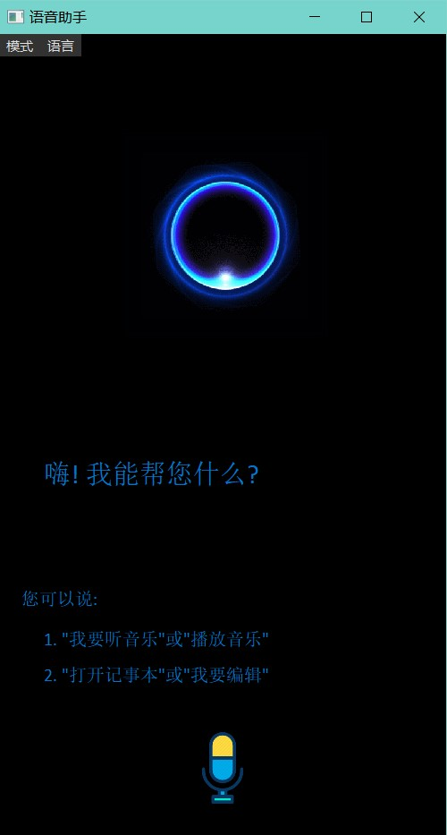</center> <center>英文界面(左)&nbsp;&nbsp;&nbsp;&nbsp;&nbsp;&nbsp;中文界面(右)</center>

#### 4.2 模式切换

 <center>   </center> <center>选择Sphinx(左)&nbsp;&nbsp;&nbsp;&nbsp;&nbsp;&nbsp;选择Google(右)</center>

#### 4.3 语言切换

 <center>   </center> <center>选择英文(左)&nbsp;&nbsp;&nbsp;&nbsp;&nbsp;&nbsp;选择中文(右)</center>

#### 4.4 识别

 <center>   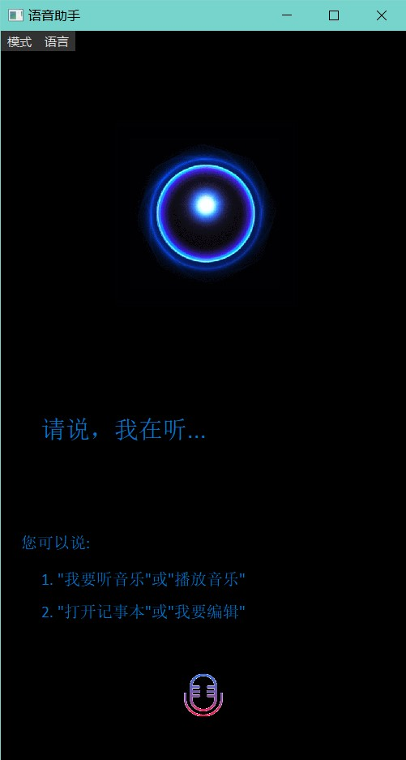</center> <center>英文模式(左)&nbsp;&nbsp;&nbsp;&nbsp;&nbsp;&nbsp;中文模式(右)</center>

#### 4.5 错误提示

 <center>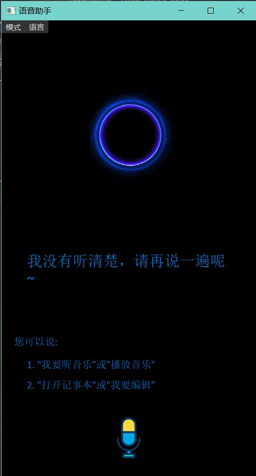   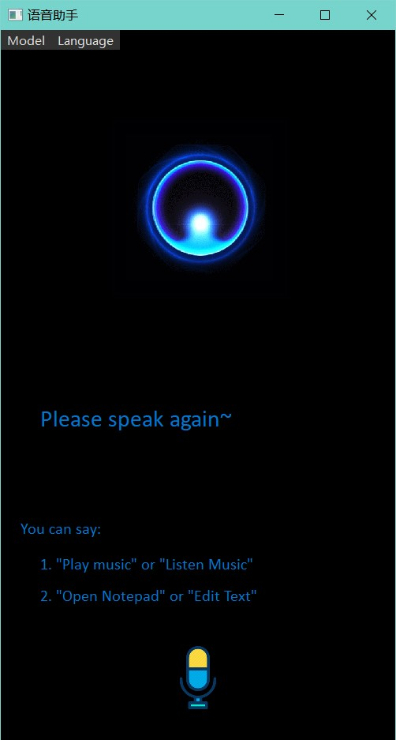 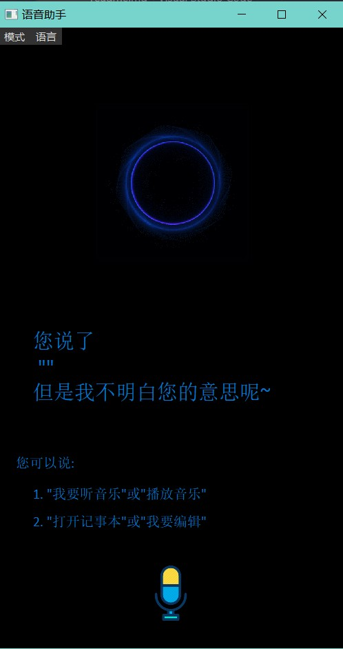   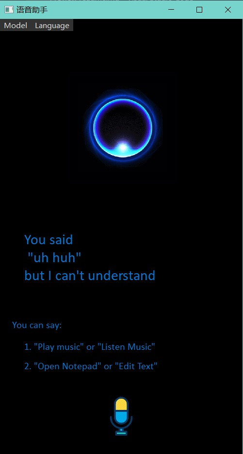</center> <center>请重复(左1~2)&nbsp;&nbsp;&nbsp;&nbsp;&nbsp;&nbsp;无法识别(右3~4)</center>

---

## 5 自测展示

#### 5.1 英文+Sphinx 识别

>

  <center>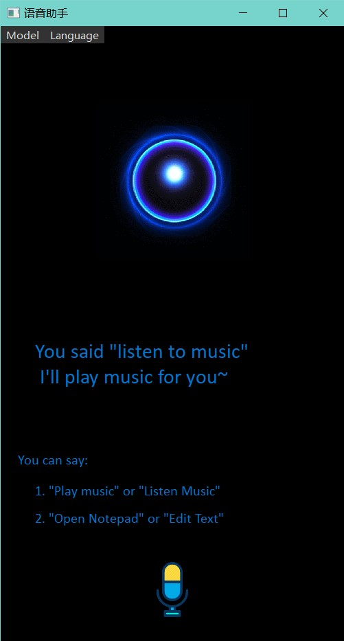  </center> <center>"I want to listen to music"(左)&nbsp;&nbsp;&nbsp;&nbsp;&nbsp;&nbsp;"listen to music"(中)&nbsp;&nbsp;&nbsp;&nbsp;&nbsp;&nbsp;"music"(右)</center>

>

  <center>  </center> <center>"I want to open notepad"(左)&nbsp;&nbsp;&nbsp;&nbsp;&nbsp;&nbsp;"open notepad"(中)&nbsp;&nbsp;&nbsp;&nbsp;&nbsp;&nbsp;"notepad"(右)</center>

#### 5.2 英文+Google 识别

>

  <center>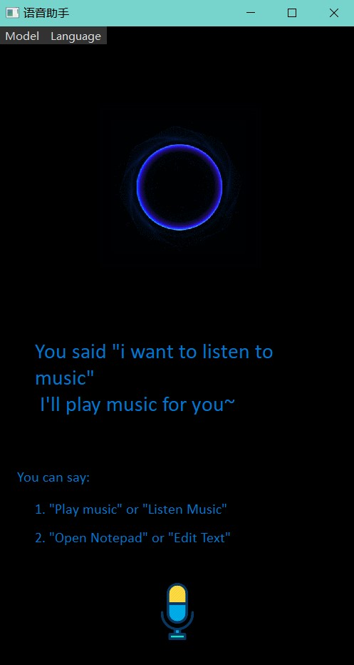 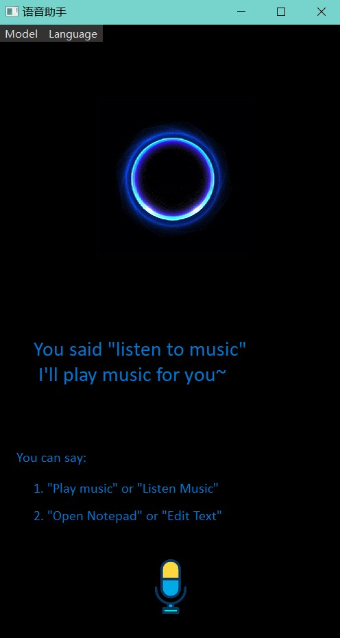 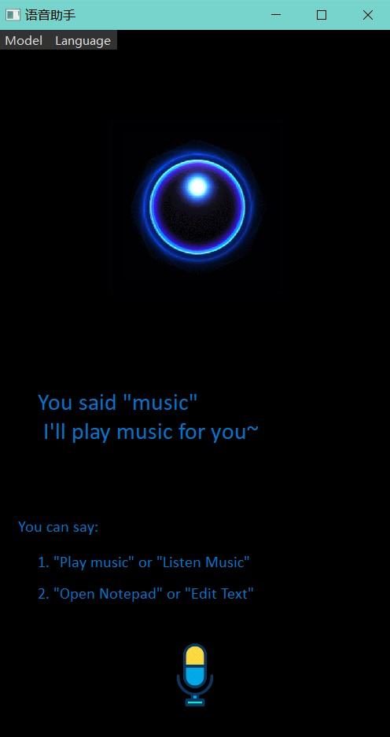</center> <center>"I want to listen to music"(左)&nbsp;&nbsp;&nbsp;&nbsp;&nbsp;&nbsp;"listen to music"(中)&nbsp;&nbsp;&nbsp;&nbsp;&nbsp;&nbsp;"music"(右)</center>

>

  <center>  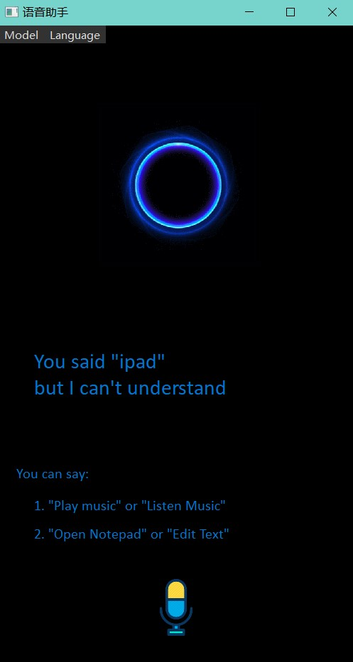</center> <center>"I want to open notepad"(左)&nbsp;&nbsp;&nbsp;&nbsp;&nbsp;&nbsp;"open notepad"(中)&nbsp;&nbsp;&nbsp;&nbsp;&nbsp;&nbsp;"notepad"(右)</center>

#### 5.3 中文+Sphinx 识别

>

  <center>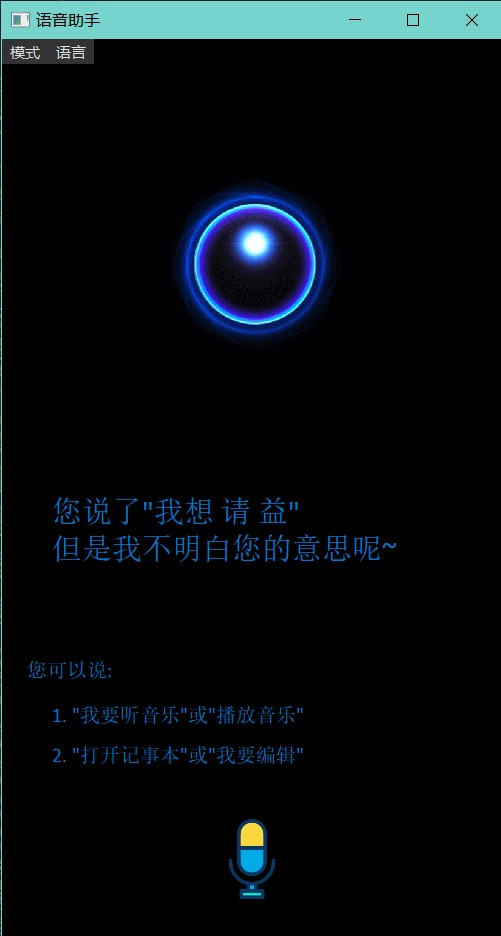  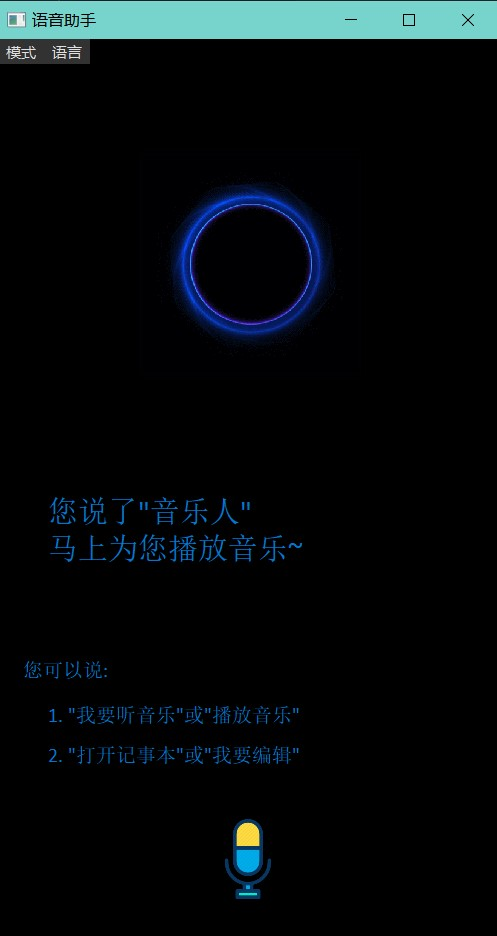</center> <center>"我想听音乐"(左)&nbsp;&nbsp;&nbsp;&nbsp;&nbsp;&nbsp;"听音乐"(中)&nbsp;&nbsp;&nbsp;&nbsp;&nbsp;&nbsp;"音乐"(右)</center>

>

  <center>  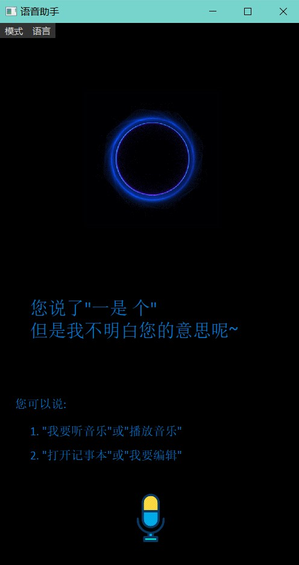</center> <center>"我想打开记事本"(左)&nbsp;&nbsp;&nbsp;&nbsp;&nbsp;&nbsp;"打开记事本"(中)&nbsp;&nbsp;&nbsp;&nbsp;&nbsp;&nbsp;"记事本"(右)</center>

#### 5.4 中文+Google 识别

>

  <center>  </center> <center>"我想听音乐"(左)&nbsp;&nbsp;&nbsp;&nbsp;&nbsp;&nbsp;"听音乐"(中)&nbsp;&nbsp;&nbsp;&nbsp;&nbsp;&nbsp;"音乐"(右)</center>

>

  <center>   </center> <center>"我想打开记事本"(左)&nbsp;&nbsp;&nbsp;&nbsp;&nbsp;&nbsp;"打开记事本"(中)&nbsp;&nbsp;&nbsp;&nbsp;&nbsp;&nbsp;"记事本"(右)</center>

## 6 准确率以及一些想法

#### 6.1 准确率

首先对于语音输入的说话时长，时长越长，识别准确率会越高。比如一句话识别的准确率相比一个单词要高一点，猜测可能识别模型中还有语义产生对比功能？

然后在任何情况下，`recognize_google()`的准确率都要比 `recognize_sphinx()`**好的多**，唯一的缺憾是`recognize_google()`需要科学上网，否则 API 将无法正常使用

但是`recognize_sphinx()`可以支持离线使用，所以识别速度比`recognize_google()`快

#### 6.2 分析

- `recognize_sphinx()`所采用的 CMU Sphinx 引擎是由[李开复](https://en.wikipedia.org/wiki/Kai-Fu_Lee)开发的，其采用 HMM (隐马尔可夫声学模型)和 n-gram 统计语言模型。在当时具有巨大的争议，只具有历史意义。而本项目所用到的包 PocketSphinx 目前也正在不断完善中，性能以及准确率自然有限，但对于语速慢的长句子如"I want to listen to music"还是基本可以识别出来。
- 而`recognize_google()`所采用的 Google Web Speech API 为 Google 所开发并采用的语音识别引擎 API，通过联网在线识别，其准确率相对高得多。
- 事实也证明，如果您使用了上述程序进行对比后，应该可以发现:对于长句子，`recognize_google()`几乎可以达到 `80%`的识别准确率，在无噪音、发音标准的情况下甚至可以达到 `90%`以上；对于短句子或单词也基本可以有`70%`。而`recognize_sphinx()`即使在无噪音、发音标准情况下的准确率也相对较低，长句子大概有`60%`,短句子或单词估计只有`30%`。

- ###### 以上所有数据均为极为有限的测试大致估计，不代表任何真实数据，只能提供一个相对的参考

#### 6.3 可进行的改进

- 因为`recognize_google()`也存在着网络环境的制约，为了普适性，应该最好采用离线型的语音识别模型
- 可以通过 NLP、LSTM、DFSMN 等语音识别框架与模型来进行搭建，以及不断地改进语音识别学习算法来进行优化

#### <span id="jump">6.4 Sphinx 中文支持 </span>

将文件路径中的 `zh-CN/`文件夹整个移动到 `speech_recognition` 包下`pocketsphinx-data/`中
查看`speech_recognition`路径可通过在`python console`，输入`import speech_recognition; print(speech_recognition.__path__)`

- 路径展示:`D:\\ProgramData\\Anaconda\\envs\\tensorflow\\lib\\site-packages\\speech_recognition`
